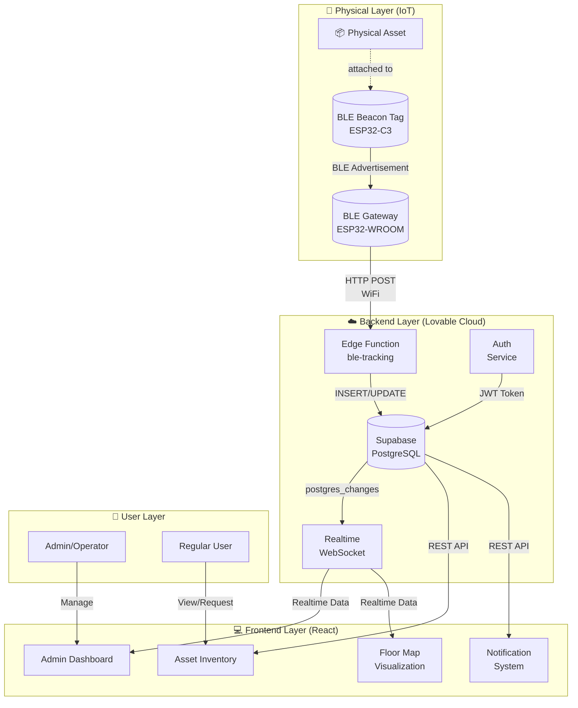
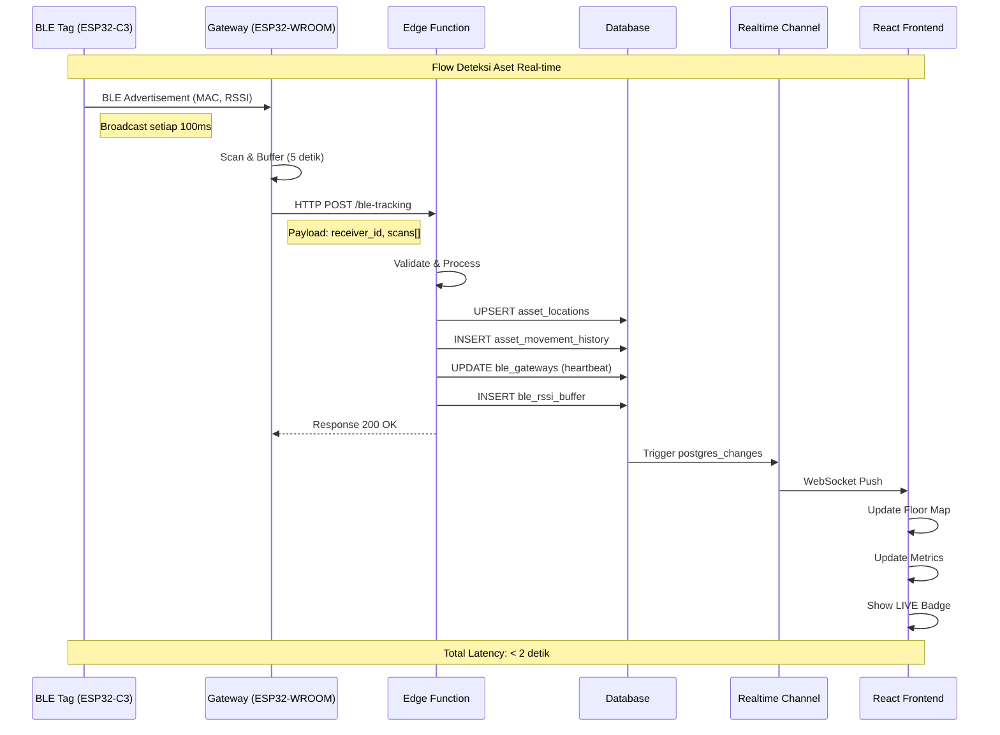
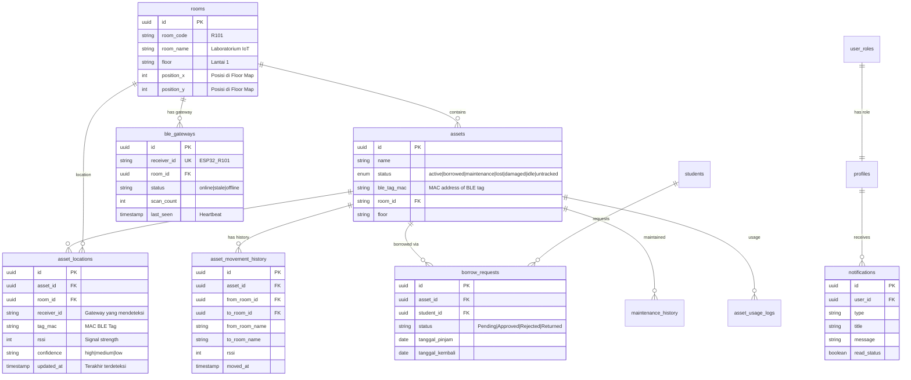
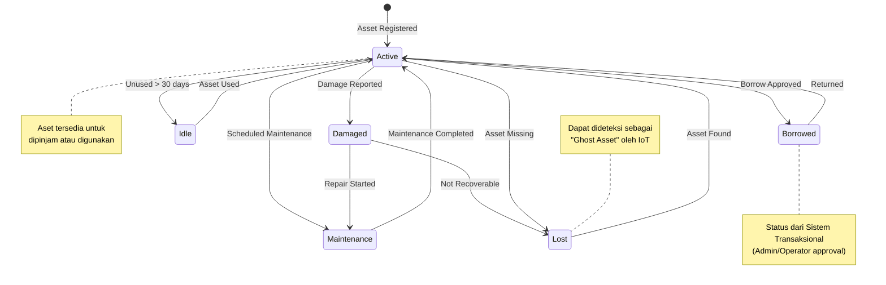
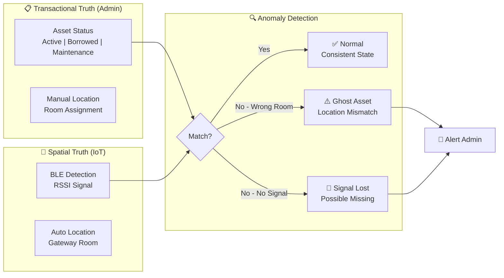
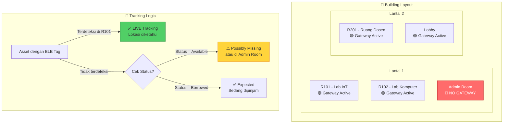

# Arsitektur Sistem Asetrace - Digital Twin Asset Tracking

Dokumen ini berisi diagram arsitektur sistem dan daftar skenario demo untuk Bab 3 dan Bab 4 skripsi.

## 1. DIAGRAM ARSITEKTUR SISTEM

### 1.1 Arsitektur High-Level (System Overview)

### 1.2 Data Flow: ESP32 to Frontend (End-to-End)

### 1.3 Arsitektur Database (ERD Simplified)

### 1.4 State Machine: Asset Status

### 1.5 Konsep Digital Twin: Two Sources of Truth

### 1.6 Blind Spot Architecture (CRITICAL CONCEPT)

---

## 2. DAFTAR SKENARIO DEMO SISTEM

### 2.1 Pre-Demo Checklist

| No | Item | Status | Notes |
|----|------|--------|-------|
| 1 | ESP32 Gateway powered on | ⬜ | Cek LED dan Serial Monitor |
| 2 | ESP32 connected to WiFi | ⬜ | Verifikasi "WiFi Connected!" |
| 3 | BLE Tag batteries checked | ⬜ | Ganti jika lemah |
| 4 | Supabase project online | ⬜ | Cek di Lovable Cloud |
| 5 | Admin account ready | ⬜ | Username dan password siap |
| 6 | Browser clear cache | ⬜ | Ctrl+Shift+R |

### 2.2 Skenario Demo End-to-End

#### **SKENARIO A: Realtime Asset Tracking**
Tujuan: Membuktikan sistem dapat melacak aset secara real-time

| Step | Action | Expected Result | Screenshot |
|------|--------|-----------------|------------|
| A1 | Login sebagai Admin | Dashboard muncul dengan metrics | ⬜ |
| A2 | Buka halaman Dashboard | Floor Map terlihat dengan gateway markers | ⬜ |
| A3 | Pastikan gateway menunjukkan status "ONLINE" | Badge hijau "Online" pada gateway | ⬜ |
| A4 | Letakkan aset (dengan BLE tag) di ruangan dengan gateway | Dalam 5-10 detik, aset muncul di Floor Map | ⬜ |
| A5 | Verifikasi badge "LIVE" muncul | Angka "X LIVE" di header Floor Map | ⬜ |
| A6 | Klik pada ruangan di Floor Map | Popup menunjukkan daftar aset di ruangan | ⬜ |
| A7 | Pindahkan aset ke ruangan lain (dengan gateway berbeda) | Lokasi aset berubah dalam 10-15 detik | ⬜ |

#### **SKENARIO B: Movement History Tracking**
Tujuan: Membuktikan sistem mencatat riwayat perpindahan aset

| Step | Action | Expected Result | Screenshot |
|------|--------|-----------------|------------|
| B1 | Buka Asset Detail page (klik aset dari inventory) | Halaman detail terbuka | ⬜ |
| B2 | Scroll ke tab "Movement" | Timeline perpindahan terlihat | ⬜ |
| B3 | Verifikasi perpindahan dari Skenario A tercatat | Entry dengan "From Room" dan "To Room" | ⬜ |
| B4 | Cek durasi "Dwell Time" | Waktu tinggal di ruangan sebelumnya | ⬜ |
| B5 | Cek RSSI chart | Grafik signal strength terlihat | ⬜ |

#### **SKENARIO C: Borrow Management Flow**
Tujuan: Membuktikan sistem peminjaman terintegrasi dengan tracking

| Step | Action | Expected Result | Screenshot |
|------|--------|-----------------|------------|
| C1 | Login sebagai User biasa | User Dashboard muncul | ⬜ |
| C2 | Buat permintaan peminjaman untuk aset | Form tersubmit, status "Pending" | ⬜ |
| C3 | Login kembali sebagai Admin | Notifikasi borrow request muncul | ⬜ |
| C4 | Approve permintaan | Status berubah ke "Approved", aset jadi "Borrowed" | ⬜ |
| C5 | Verifikasi notifikasi dikirim ke User | User menerima notifikasi approval | ⬜ |
| C6 | Proses pengembalian aset | Status kembali ke "Active" | ⬜ |

#### **SKENARIO D: Gateway Heartbeat & Status**
Tujuan: Membuktikan sistem mendeteksi gateway online/offline

| Step | Action | Expected Result | Screenshot |
|------|--------|-----------------|------------|
| D1 | Buka halaman BLE Configuration | Daftar gateway terlihat | ⬜ |
| D2 | Pastikan gateway menunjukkan "ONLINE" | Badge hijau, timestamp "just now" | ⬜ |
| D3 | Matikan ESP32 Gateway (cabut power) | Status berubah ke "STALE" dalam 15-45 detik | ⬜ |
| D4 | Tunggu 1 menit | Status berubah ke "OFFLINE" | ⬜ |
| D5 | Nyalakan kembali ESP32 | Status kembali ke "ONLINE" dalam 10-15 detik | ⬜ |

#### **SKENARIO E: AI Report Generation**
Tujuan: Membuktikan sistem dapat menghasilkan insight berbasis AI

| Step | Action | Expected Result | Screenshot |
|------|--------|-----------------|------------|
| E1 | Buka halaman Reports | Tombol "Generate AI Report" terlihat | ⬜ |
| E2 | Klik tombol Generate Report | Loading indicator muncul | ⬜ |
| E3 | Tunggu proses selesai | Report markdown muncul dengan insights | ⬜ |
| E4 | Verifikasi konten report mencakup: | | |
| | - Asset distribution summary | ⬜ | |
| | - Movement patterns | ⬜ | |
| | - Anomaly detection (ghost assets) | ⬜ | |
| | - Recommendations | ⬜ | |
| E5 | Export report ke PDF | File terdownload | ⬜ |

#### **SKENARIO F: Notification System**
Tujuan: Membuktikan sistem notifikasi real-time berfungsi

| Step | Action | Expected Result | Screenshot |
|------|--------|-----------------|------------|
| F1 | Buka halaman Notifications | Daftar notifikasi terlihat | ⬜ |
| F2 | Create borrow request dari user lain | Notifikasi baru muncul untuk admin | ⬜ |
| F3 | Klik notifikasi | Detail notifikasi terbuka | ⬜ |
| F4 | Mark as read | Status berubah (tidak bold) | ⬜ |
| F5 | Cek notification bell di header | Counter badge terupdate | ⬜ |

#### **SKENARIO G: Ghost Asset Detection**
Tujuan: Membuktikan sistem dapat mendeteksi anomali lokasi

| Step | Action | Expected Result | Screenshot |
|------|--------|-----------------|------------|
| G1 | Pastikan aset memiliki status "Active" (Available) | Status terlihat di inventory | ⬜ |
| G2 | Pastikan aset ter-assign ke Room A | Location: Room A di detail | ⬜ |
| G3 | Pindahkan aset (fisik) ke Room B | BLE mendeteksi di Room B | ⬜ |
| G4 | Generate AI Report | Report menunjukkan "Ghost Asset" atau "Location Mismatch" | ⬜ |
| G5 | Alternatif: Cek icon warning di Floor Map | Icon segitiga kuning muncul | ⬜ |

### 2.3 Post-Demo Verification

| Verification | Pass | Notes |
|--------------|------|-------|
| All real-time updates worked without page refresh | ⬜ | |
| No console errors during demo | ⬜ | |
| Response time < 5 seconds for all actions | ⬜ | |
| Data consistency between pages | ⬜ | |
| Mobile responsive layout (if tested) | ⬜ | |

---

## 3. TIPS UNTUK PRESENTASI SKRIPSI

### 3.1 Highlight Fitur Utama

1. **Digital Twin Concept**: Tekankan dua sumber kebenaran (Transaksional vs Spatial)
2. **Realtime Tracking**: Demo live perpindahan aset
3. **Blind Spot Architecture**: Jelaskan mengapa Admin Room tidak ada gateway
4. **Ghost Asset Detection**: Sistem mendeteksi aset "nakal"
5. **AI Integration**: Report otomatis dengan insight

### 3.2 Antisipasi Pertanyaan Penguji

| Pertanyaan | Jawaban |
|------------|---------|
| "Bagaimana jika WiFi mati?" | Gateway akan offline, tapi data terakhir tetap tersimpan. Saat online kembali, akan sync otomatis. |
| "Akurasi RSSI?" | RSSI digunakan untuk proximity, bukan koordinat presisi. Threshold -85 dBm untuk "high confidence". |
| "Scalability?" | Arsitektur edge function stateless, dapat handle ribuan gateway dengan horizontal scaling. |
| "Security?" | RLS policies di setiap tabel, JWT authentication, role-based access control. |

### 3.3 Screenshot Checklist untuk Dokumentasi

- [ ] Dashboard dengan metrics
- [ ] Floor Map dengan gateway online
- [ ] Floor Map dengan asset LIVE
- [ ] Asset Detail dengan Movement Timeline
- [ ] Asset Detail dengan RSSI Chart
- [ ] Borrow Request flow (Pending → Approved → Returned)
- [ ] Notification list
- [ ] AI Report output
- [ ] BLE Configuration dengan gateway list
- [ ] Mobile responsive view

---

*Dokumen ini dibuat untuk keperluan Bab 3 (Metodologi) dan Bab 4 (Hasil & Pembahasan) skripsi.*
